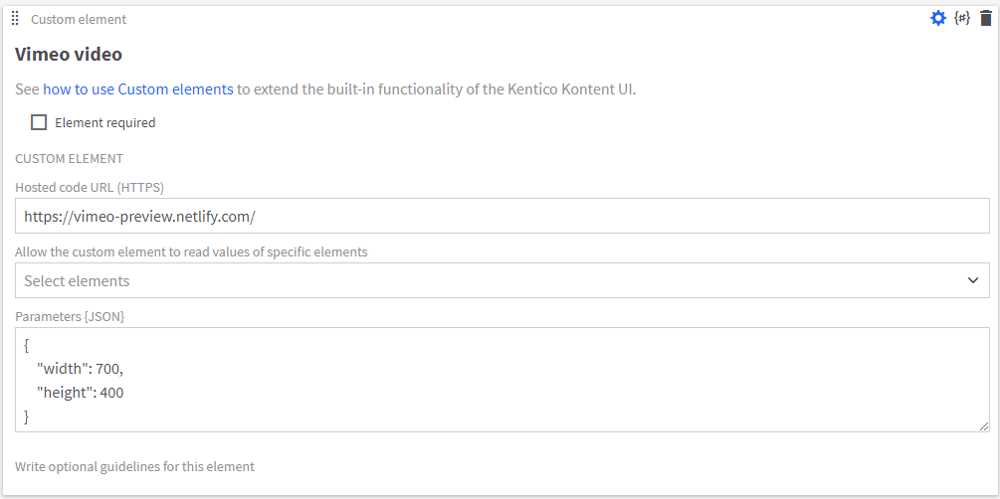

# Vimeo preview custom element for Kentico Kontent

This Kentico Kontent <a href="https://docs.kontent.ai/tutorials/develop-apps/integrate/integrating-your-own-content-editing-features">custom element</a> allows the editor to preview a Vimeo video directly in <a href="https://kontent.ai/">Kontent</a>'s UI. 
The element can be tested by configuring the following URL for the custom element's "Hosted code URL" field.
https://vimeo-preview.netlify.com/

There is also a possibility to adjust the size of the video displayed within the UI.
This can easily be done in the custom element's "Parameters {JSON}" field.

The whole set up of the element could look like this. <br/>


With the final output looking like this from the editor's perspective. <br/>


## Setup

1. Deploy the code to a secure public host
    * See [deploying section](#Deploying) for a really quick option
2. Follow the instructions in the [Kentico Kontent documentation](https://docs.kontent.ai/tutorials/develop-apps/integrate/integrating-your-own-content-editing-features#a-3--displaying-a-custom-element-in-kentico-kontent) to add the element to a content type.
    * The `Hosted code URL` is where the element has been deplyed to in step 1
    * The size of the preview can be changed as per sample parameters in the [JSON Parameters configuration](#json-parameters) section of this readme.

## JSON Parameters

```Json
{
    "width": 700,
    "height": 400
}
```

## Saved value

The following is returned by the Deliveri API. 
```Json
"elements": {
   "vimeo_video": {
     "type": "custom",
     "name": "Vimeo video",
     "value": "183941852"
   }
 }
```

## Deploying

Netlify has made this easy. If you click the deploy button below, it will guide you through the process of deploying it to Netlify and leave you with a copy of the repository in your GitHub account as well.

[](https://app.netlify.com/start/deploy?repository=https://github.com/matus666/kontent-custom-element-vimeo-preview)
